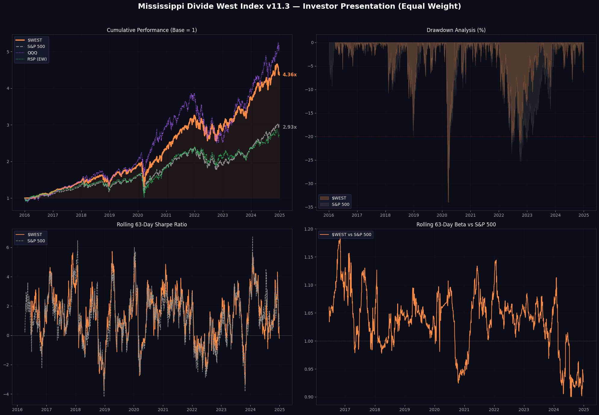

[README.md](https://github.com/user-attachments/files/30669824/README.md)
# $WEST — Mississippi Divide West Index

<p align="center">
  
  
  
  
</p>

<p align="center">
  <a href="https://colab.research.google.com/github/sehenriquez-ch/mississippi-west-index/blob/main/notebooks/quickstart.ipynb">
    
  </a>
</p>

<h1 align="center">Geography as a Factor</h1>
<p align="center"><em>An equal-weight index of S&P 500 companies headquartered West of the Mississippi River.</em></p>

---

## 🎯 The Thesis in One Line

> Companies headquartered **West of the Mississippi River** have built a distinct economic ecosystem—technology, energy, favorable demographics, and business-friendly fiscal policy.  
> **$WEST** quantifies that thesis as an investable index.

Less concentrated in mega-cap tech than QQQ or cap-weighted alternatives, but with persistent exposure to the sector through a broader West-of-Mississippi footprint.

---

## ⚠️ Known Limitations (Read This First)

Before interpreting the numbers below, these are the constraints that bound our confidence:

| Limitation | Impact | Status |
|------------|--------|--------|
| **Shares outstanding** are current proxies, not point-in-time historical | May distort historical market-cap and ADV calculations | Documented; seeking Compustat/CRSP data |
| **Free-float** is estimated from public filings, not measured | Weight and liquidity filters carry approximation error | Documented; seeking institutional validation |
| **Transaction costs** are not yet modeled | Real-world CAGR would be lower (turnover ~3.7% / rebalance) | On roadmap |
| **Methodology iterated ~11 versions** | Risk of data-mining bias; walk-forward below is the antidote | Mitigated with out-of-sample test |
| **Selection uses T+0 prices** | Real execution would require T+1 or T+2 slippage | On roadmap |

These limitations are why this is labeled a **research experiment**, not a live product. The numbers are directionally informative; they are not precise NAVs.

---

## 📊 Backtest Summary (2016 – 2024)

| Metric | $WEST | RSP (Equal-Weight) | S&P 500 | QQQ |
|--------|-------|-------------------|---------|-----|
| **CAGR** | **18.61%** | 11.64% | 12.74% | 19.73% |
| **Volatility** | 19.28% | 18.65% | 18.06% | 22.20% |
| **Sharpe Ratio** | **0.75** | 0.40 | 0.48 | 0.70 |
| **Sortino Ratio** | **0.90** | 0.48 | 0.57 | 0.89 |
| **Max Drawdown** | -34.04% | -39.04% | -33.92% | -35.12% |
| **Total Return** | **336.14%** | 168.90% | 193.49% | 403.71% |
| **Alpha vs RSP** | **+4.40%** | — | — | — |
| **Alpha vs S&P 500** | +3.00% | — | — | — |
| **Beta vs RSP** | 1.04 | 1.00 | — | — |
| **Tracking Error** | 4.21% | — | — | — |
| **Information Ratio** | 0.87 | — | — | — |
| **Upside Capture** | 106.3% | — | — | — |
| **Downside Capture** | 103.5% | — | — | — |
| **VaR 95% (daily)** | -1.75% | -1.68% | -1.71% | -2.30% |
| **CVaR 95% (daily)** | -2.91% | — | — | — |
| **Skewness** | -0.64 | — | — | — |
| **Kurtosis** | 15.56 | — | — | — |
| **Positive Months %** | 56.0% | — | — | — |
| **Gain/Pain Ratio** | 1.21 | — | — | — |
| **Omega Ratio** | 1.21 | — | — | — |

**Methodology:** Equal-weight (1/N), quarterly rebalancing, liquidity filter ($ADV > 500k), position cap (15%) and sector cap (25%).  
**Statistical rigor:** Regression with Newey-West HAC standard errors to test alpha significance.

> **The key number:** +4.40% annual alpha vs RSP (equal-weight S&P 500) with p = 0.0148 under Newey-West. Same weighting scheme, same universe, different geography. That is the geographic edge.

---

## 🔬 Out-of-Sample Walk-Forward (2025 – 2026)

To mitigate data-mining risk from ~11 iterations of methodology refinement, we ran a **true out-of-sample test** on data never used during development:

| Metric | $WEST | RSP | Notes |
|--------|-------|-----|-------|
| **Alpha vs RSP** | **+4.29%** (annualized) | — | Live market data, Jan 2025 – present |
| **Statistical significance** | Not yet (small sample) | — | ~300 observations; needs 6–12 months more |
| **Direction** | Consistent with backtest | — | Alpha positive, not negative or zero |

The walk-forward does not *prove* the backtest, but it fails to falsify it. If the alpha had collapsed or reversed sign, we would have discarded the thesis. It did not.

---

## 🔬 Is $WEST Actually Different?

We run alpha regression vs QQQ and RSP with **Newey-West HAC standard errors**—because uncorrected OLS lies about significance when returns are autocorrelated.

### vs RSP (S&P 500 Equal-Weight)

| Statistic | Value |
|-----------|-------|
| Correlation | 0.9546 |
| Beta | 0.990 |
| R² | 0.911 |
| Alpha (annual) | **+4.40%** |
| p-value (OLS) | 0.0252 |
| **p-value (Newey-West, 7 lags)** | **0.0148** |
| **Verdict** | ✅ Alpha SIGNIFICANT even with Newey-West—solid evidence of real edge. |

### vs QQQ (Nasdaq-100)

| Statistic | Value |
|-----------|-------|
| Correlation | 0.9002 |
| Beta | 0.782 |
| R² | 0.810 |
| Alpha (annual) | +1.05% |
| p-value (OLS) | 0.7145 |
| **p-value (Newey-West, 7 lags)** | **0.7383** |
| **Verdict** | ⚠️ Alpha NOT significant. $WEST does not generate reliable alpha vs QQQ. |

> The geographic filter generates **+4.40% annual alpha vs equal-weight S&P 500** with statistical significance. That is the number that matters.

---

## 📅 Year-by-Year Returns

| Year | $WEST | RSP | S&P 500 | QQQ | WEST vs RSP |
|------|-------|-----|---------|-----|-------------|
| 2016 | +15.6% | +15.8% | +11.2% | +9.4% | ❌ |
| 2017 | +23.8% | +18.5% | +19.4% | +32.7% | ✅ |
| 2018 | -1.2% | -7.8% | -6.2% | -0.1% | ✅ |
| 2019 | +33.9% | +28.9% | +28.9% | +39.0% | ✅ |
| 2020 | +24.5% | +12.7% | +16.3% | +48.4% | ✅ |
| 2021 | +37.6% | +29.4% | +26.9% | +27.4% | ✅ |
| 2022 | -11.4% | -11.6% | -19.4% | -32.6% | ✅ |
| 2023 | +30.5% | +13.7% | +24.2% | +54.9% | ✅ |
| 2024 | +16.3% | +12.6% | +23.8% | +26.7% | ✅ |

**$WEST outperformed RSP in 8 of 9 years.** The only miss was 2016, by a razor-thin margin (+15.6% vs +15.8%). QQQ led in 2017, 2019, 2020, and 2023—this is expected given its heavy tech concentration.

<p align="center">
  
</p>

---

## 🔄 Turnover & Drawdown Analysis

| Metric | Value |
|--------|-------|
| Avg. Turnover / Rebalance | 3.72% |
| Max Turnover / Rebalance | 8.00% |
| Rebalances Executed | 35 |
| Drawdowns >1% | 86 |
| Avg. Recovery Time | 22 days |

---

## 🗺️ Why West of the Mississippi?

| Factor | West | East |
|--------|------|------|
| **Technology** | CA, WA, TX, CO | Concentrated in NY/MA |
| **Energy** | TX, NM, CO, AK | Import-dependent |
| **Demographics** | Net positive migration | Stagnation / outflow |
| **Fiscal Policy** | No state income tax (TX, WA, NV, WY) | Higher historical tax burden |

This is not just "buy tech." It is a **concentration of human and physical capital** along a corridor stretching from Seattle to Austin through Denver and Los Angeles.

---

## ⚙️ Methodology Overview

### High-Level Flow

```
S&P 500 Historical Constituents
        │
        ▼
┌─────────────────────────────┐
│  HQ West of Mississippi?    │
└─────────────────────────────┘
        │ Yes
        ▼
┌─────────────────────────────┐
│  Liquidity Filter (ADV>$500k)│
└─────────────────────────────┘
        │
        ▼
┌─────────────────────────────┐
│  Select Top 100              │
└─────────────────────────────┘
        │
        ▼
┌─────────────────────────────┐
│  Equal-Weight (1/N)          │
│  + 15% position cap          │
│  + 25% sector cap            │
└─────────────────────────────┘
        │
        ▼
┌─────────────────────────────┐
│  Rebalance Quarterly         │
│  (3rd Friday of Mar/Jun/Sep/Dec) │
└─────────────────────────────┘
```

### Key Parameters

| Parameter | Value | Rationale |
|-----------|-------|-----------|
| **Universe** | Historical S&P 500 constituents | Liquid, investable, auditable |
| **Geographic boundary** | Mississippi River | Natural economic divide; states classified by HQ location |
| **Liquidity filter** | ADV > $500,000 USD | Ensures investability at scale |
| **Max constituents** | 100 | Manageable for equal-weight implementation |
| **Weighting** | Equal-weight (1/N) | Eliminates cap-weight concentration; forces diversification |
| **Position cap** | 15% | Prevents single-name dominance |
| **Sector cap** | 25% | Prevents sector concentration |
| **Rebalance frequency** | Quarterly | 3rd Friday of March, June, September, December |
| **Selection date** | 5 trading days before rebalance | Mimics real-world notice period |
| **Index base** | 1,000 | Standard reference level |

### Geographic Classification

HQ state is mapped to **East**, **West**, or **Neutral** using a static map. Historical corrections are applied for known relocations:

| Ticker | Pre-Date | Post-Date | State |
|--------|----------|-----------|-------|
| TSLA | CA | Dec 2021 | TX |
| ORCL | CA | Dec 2020 | TX |
| HPQ | CA | Dec 2020 | TX |
| SCHW | CA | Jan 2021 | TX |
| CBRE | CA | Jan 2020 | TX |

Delisted tickers with known historical HQs are also mapped to prevent look-ahead bias.

### Statistical Testing

All alpha claims are tested with **Newey-West HAC standard errors** to correct for autocorrelation in daily returns. OLS p-values are reported for comparison but are **not** the basis for significance claims.

For full methodology details, see [`METHODOLOGY.md`](METHODOLOGY.md).

---

## 🚀 Installation & Usage

### Local

```bash
# Clone
git clone https://github.com/sehenriquez-ch/mississippi-west-index.git
cd mississippi-west-index

# Dependencies
pip install -r requirements.txt

# Run backtest
python mississippi_west.py --start 2016-01-01 --end 2024-12-31
```

### One-Click (Google Colab)

Click the badge at the top of this README. Zero installation. The notebook downloads the script, installs dependencies, and runs the full backtest in ~3 minutes.

---

## 📁 Repo Structure

```
mississippi-west-index/
├── mississippi_west.py          # Core engine (v11.3 — frozen)
├── notebooks/
│   └── quickstart.ipynb         # Colab-ready, 1-click run
├── METHODOLOGY.md               # Full methodology documentation
├── requirements.txt
├── output/                      # Generated results (gitignored)
├── data/                        # Cache & backups
├── logs/                        # Execution logs
├── README.md                    # This file
└── LICENSE
```

---

## 🎯 Roadmap

- [x] Backtest 2016–2024 with equal-weight methodology
- [x] Newey-West HAC correction for alpha significance
- [x] Kurtosis diagnostic
- [x] Walk-forward out-of-sample validation (2025–2026, preliminary)
- [ ] Transaction cost & slippage modeling
- [ ] Expand walk-forward to 12+ months for statistical power
- [ ] Live paper trading (2025–2026)
- [ ] Formal Rulebook for index provider discussions

---

## 🤝 Contributing

This is an open research experiment. Found a bug? Have better data (point-in-time shares outstanding, institutional free-float)? Want to test a variant geography (Rocky Mountains? Cascadia?)? Open an issue or PR.

**Areas where we need help:**
- Point-in-time shares outstanding data (Compustat/CRSP/Sharadar).
- Institutional free-float validation.
- Realistic transaction cost modeling.
- Unit tests for the rebalance engine.

---

## ⚠️ Disclaimer

This repository is a **quantitative research experiment**.
- It is **not** investment advice.
- Past performance does not guarantee future results.
- Before any investment decision, consult a qualified financial advisor.

---

<p align="center">
  <b>⭐ Star this repo if you believe geography matters in markets.</b><br/>
  <b>🍴 Fork it if you want to test your own geographic frontier.</b>
</p>
